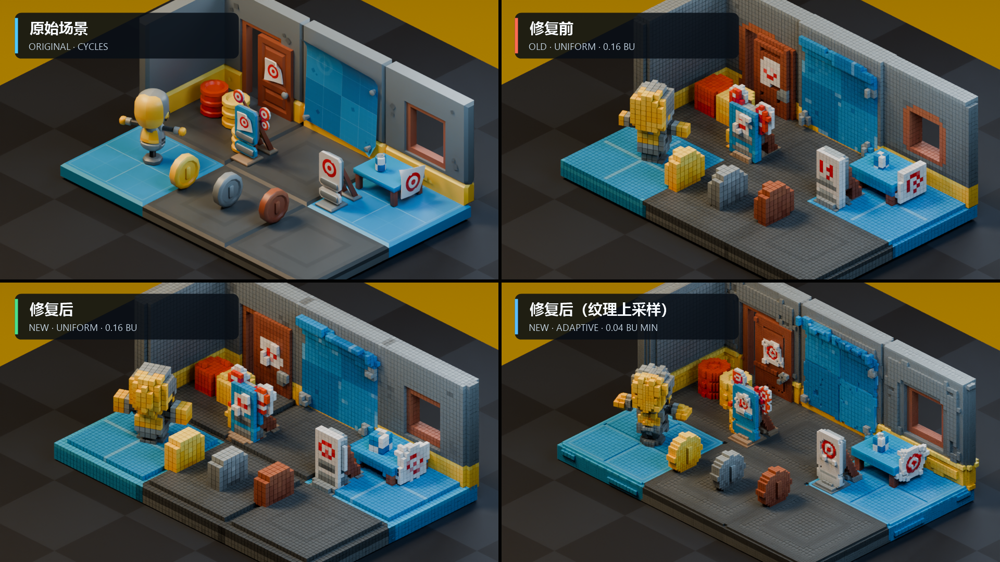
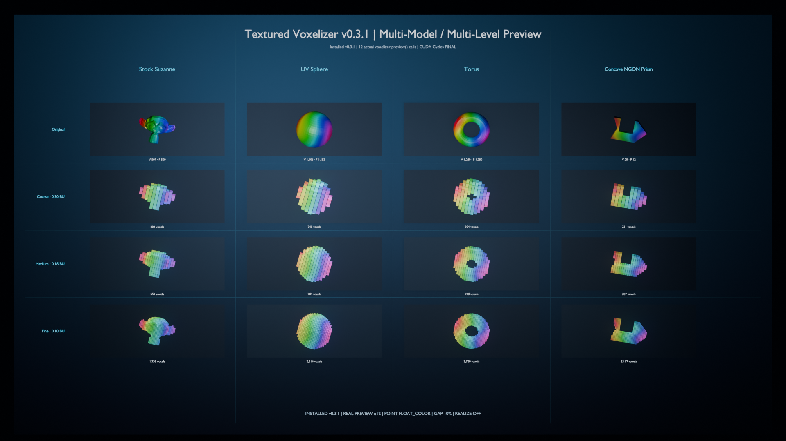
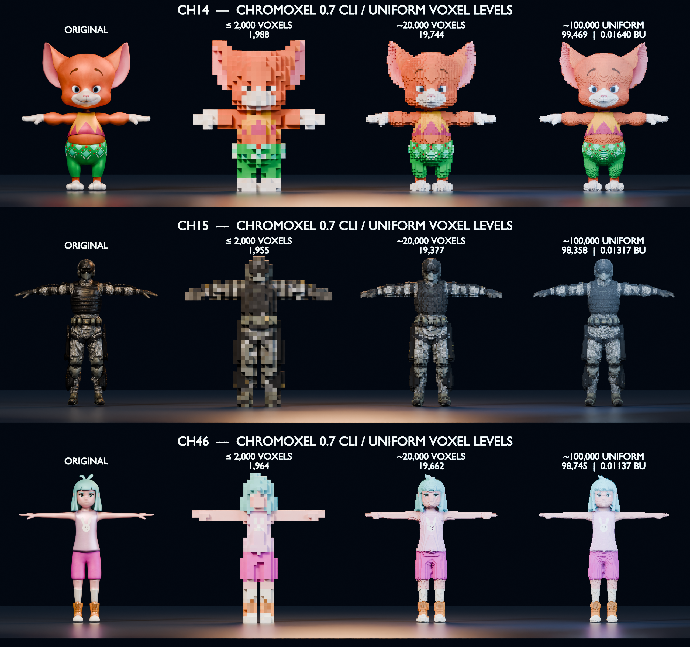
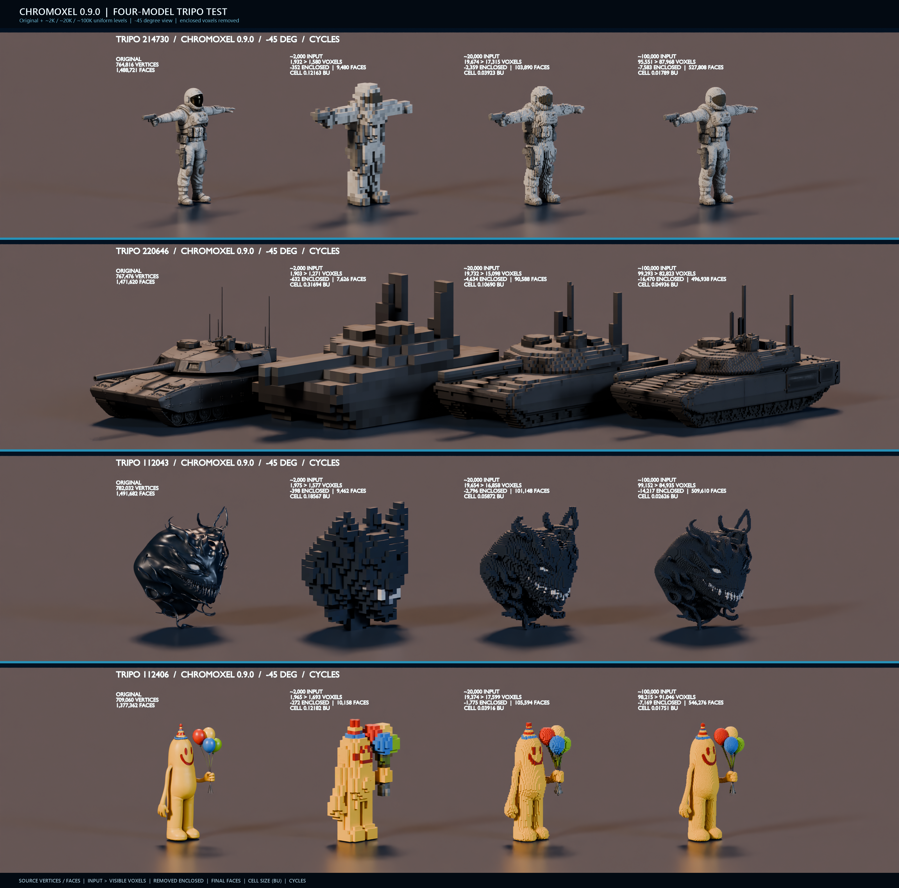
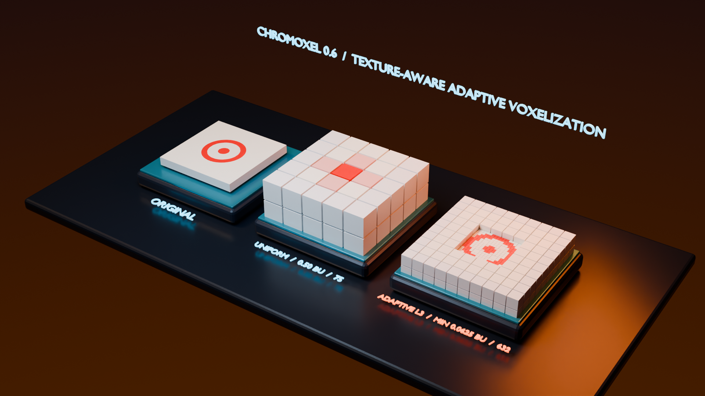

# Chromoxel（纹彩体素）for Blender 5.1

**Adaptive, texture-aware, symmetry-safe voxelization for Blender.**

**面向 Blender 的自适应、纹理感知、对称安全体素化工具。**

**Version / 版本：** 0.9.0 · **Status / 状态：** Beta · **Target / 目标版本：** Blender 5.1+

[English](#english) · [简体中文](#简体中文)

## Texture-detail adaptive upsampling / 纹理细节自适应上采样



**Chromoxel 0.6 does not force the entire scene to use 0.04 BU voxels.** It
starts from a 0.16 BU base grid, measures texture-footprint contrast and
geometric edge error, then selectively upsamples high-frequency regions such
as bullseyes, circular markings, thin lines, and sharp colour boundaries to
0.08 or 0.04 BU. Broad, low-detail areas remain coarser, concentrating the
voxel and sampling budget where it contributes visible detail.

Grid-aligned flat faces use surface-preserving 2D refinement: Chromoxel
subdivides along the face while retaining the parent cell's normal thickness.
This keeps mixed 0.16/0.08/0.04 BU levels flush instead of introducing bumps
or grooves. Curved and non-axis-aligned regions continue to use full 3D
refinement for silhouette accuracy.

对于与体素网格对齐的平整表面，Chromoxel 采用保持表面共面的二维细分：只沿表面方向提高
分辨率，并保留父体素在法线方向的厚度。因此 0.16/0.08/0.04 BU 混合层级不会在平面上
产生凹凸或沟槽；曲面和非轴对齐区域仍使用完整三维细分，以保持轮廓精度。

**Chromoxel 0.6 不会把整个场景无差别压到 0.04 BU。** 它以 0.16 BU
为基础网格，分析纹理足迹对比度和几何边缘误差，只对圆形靶纸、细线、锐利颜色边界等
高频区域进行 0.08/0.04 BU 局部上采样；大面积低细节区域维持较粗体素，把体素数量和
采样预算集中在真正影响画面的位置。

The four panels use the same camera, KayKit scene, materials, lighting, and
Cycles pipeline: **Original** (top-left), **old uniform 0.16 BU** (top-right),
**Chromoxel 0.6 uniform 0.16 BU** (bottom-left), and **Chromoxel 0.6 adaptive,
0.04 BU minimum** (bottom-right). The lower pair isolates the benefit of
detail-aware upsampling from general version and render-pipeline differences.

四格使用完全相同的相机、KayKit 场景、材质、光照和 Cycles 管线：左上为原始场景，
右上为修复前的老版本统一 0.16 BU，左下为新版本统一 0.16 BU，右下为新版本自适应
细分（最小 0.04 BU）。下排直接隔离了纹理细节上采样本身带来的提升。

> Scene assets / 场景素材：**KayKit: Prototype Bits 1.1** by Kay Lousberg,
> licensed under [CC0 1.0](https://creativecommons.org/publicdomain/zero/1.0/).



> Four source meshes at coarse, medium, and fine voxel sizes. The comparison
> demonstrates texture colour sampling, exact symmetry closure, curved and
> sharp-edge coverage, and concave NGON handling.
>
> 四种源模型在粗、中、细三种体素尺寸下的对比，展示贴图颜色采样、精确对称闭包、
> 曲面与锐边覆盖，以及凹 NGON 处理能力。

### Character-scale voxel budgets / 角色级体素预算



> Three textured character meshes shown as the original and at approximately
> 2K, 20K, and 100K uniform voxel budgets. This Chromoxel 0.7 CLI acceptance
> image demonstrates progressive silhouette convergence, texture-colour
> retention, and a consistent cell size within each 100K result. Target-count
> fitting allows a tolerance of up to 5%. Chromoxel 0.8 preserves this output
> contract while accelerating source preparation, sampling, and colour reads.
>
> 三个带纹理角色分别展示原始模型以及约 2K、20K、100K 的均匀体素预算结果。
> 这张 Chromoxel 0.7 CLI 验收图展示了轮廓随体素预算逐级收敛、纹理颜色保留，
> 以及每个 100K 结果内部一致的体素尺寸；目标数量拟合允许最多 5% 的误差。
> Chromoxel 0.8 保持相同的输出约定，并加速源数据准备、采样和颜色读取。
>
> Character test assets / 角色测试素材：locally supplied Mixamo character
> files used for validation. Only this rendered comparison is included; the
> source meshes and textures are not redistributed.

### Dense Tripo four-model test / 高密度 Tripo 四模型测试



> Four locally supplied 1.38–1.49-million-face Tripo meshes are shown as the
> original and at approximately 2K, 20K, and 100K Uniform input voxels. Every
> row uses the same -45-degree model view, Cycles/OptiX lighting, and enclosed-voxel
> optimization. The labels report source topology, input and visible voxel
> counts, removed enclosed cells, final faces, and cell size.
>
> 四个本地提供的约 138–149 万面 Tripo 模型分别展示原始模型和约 2K、20K、100K
> Uniform 输入体素。四行统一使用 -45° 模型朝向、Cycles/OptiX 光照与内部体素剔除；标签列出
> 源拓扑、输入/可见体素、删除的内部体素、最终面数与体素尺寸。仅包含渲染结果，不重新分发
> 源 GLB 或贴图。



> v0.6 visual acceptance: the uniform 0.50 BU grid misses most of the circular
> marking, while bounded adaptive L3 refinement resolves the ring down to
> 0.0625 BU without globally applying that fine voxel size.
>
> v0.6 圆形纹理验收：统一 0.50 BU 网格会丢失大部分圆环；受预算约束的 L3
> 自适应细分仅在纹理边界降至 0.0625 BU，无需让整个模型都使用最小体素。

---

<a id="english"></a>

## English

Chromoxel converts selected meshes into coloured surface-voxel shells. Its
Geometry Nodes point Preview is now a durable editable voxel model, with four
Bake targets and MagicaVoxel `.vox` interchange.

### What is new in 0.9.0

- **Real GPU Uniform occupancy.** In an interactive Blender window, Auto/GPU
  can reject empty lattice candidates with a bounded compute shader. A
  conservative triangle-AABB lower bound feeds exact CPU BVH confirmation, so
  GPU and CPU keep identical voxel coordinates. Headless or unsupported
  systems fall back automatically.
- **Large-source sessions stay warm.** Preview and direct Bake reuse evaluated
  source/sampling snapshots, symmetry proof, BVHs, texture state, GPU triangle
  upload, and up to two resolution indexes. Changing only Voxel Size no longer
  repeats million-face source preparation; **Clear Sampling Cache** releases
  all prepared CPU/GPU resources.
- **Bounded large-mesh generation.** Sparse candidates use exact NumPy
  chunked-mask rasterization on bounded grids, while full-grid work uses a
  lazy sliceable sequence. GPU dispatch stays capped by **GPU Batch Size** and
  the default **512 MiB** memory ceiling.
- **Visible performance diagnostics.** Expand **Advanced > Last voxelization**
  to see source, candidates, occupancy, colour, voxel count, BVH queries, and
  backend. CLI JSON now adds `timings`, `sampling_phase_timings`,
  `source_session_timings`, `occupancy_backend`, and `bvh_query_count`.
- **Numbered bilingual workflow.** Language selection, output type,
  **Create Preview**, and **Start Bake** now stay at the top. The remaining
  controls are grouped into eight collapsible steps: source, grid, surface,
  colour, preview, Bake, edit/export, and live preview. Choosing English or
  Chinese now applies to the complete workflow instead of only its lower half.

On the validated Blender 5.1.2 workstation, two supplied 1.47-1.49-million-
face Tripo sources produced exact CPU/GPU coordinate matches at roughly 2K,
20K, and 97K voxels. The 97K sampling pass measured 3.97/6.25 seconds cold and
3.75/5.46 seconds warm, after one 6.44/10.44-second source preparation. These
numbers are hardware- and asset-dependent; texture loading, import, carrier
creation, mesh Bake, and saving are reported separately.

### What is new in 0.8.2

- Added an opt-in **Remove Enclosed Voxels** Bake option. It removes only cells
  whose six axis-aligned sides are completely covered, while retaining exterior
  silhouettes, thin parts, holes, colours, UVs, and editable material data.
- Uniform carriers use an O(N) six-neighbour lookup. Adaptive carriers are
  checked exactly on the minimum-cell lattice up to a bounded two-million-cell
  safety limit; oversized expansion is skipped instead of deleting uncertain
  geometry.
- The option is available in the Blender UI and as
  `--remove-enclosed-voxels` in the CLI. It defaults to off, so existing files
  and scripts keep their prior output.

### What is new in 0.8.1

- Opening `N > Voxelizer` is passive and does not inspect mesh topology.
  **Check Surface** is an explicit, cached full diagnostic.
- Dense-source preparation uses bounded Preview keys, bulk geometry hashes,
  fast readiness rejection, conservative symmetry prechecks, and lazy Uniform
  colour structures without weakening exact symmetry proof on possible axes.
- CLI target fitting reuses one session for every attempt, accepts only the
  requested tolerance, and never saves an out-of-range fallback as PASS.
- On the 1.47-million-face Tripo benchmark, SourceSession preparation fell
  from 78.83 s to 6.38 s; the formerly duplicated 2K CLI job fell from
  185.35 s to 17.7 s end-to-end, including import and save.

### What is new in 0.8

- **Auto / GPU / CPU compute backends.** Uniform texture colour reconstruction
  can run through a real Blender compute shader in an interactive GPU context;
  unsupported and headless sessions fall back to the matching CPU result.
- A reusable source session keeps the evaluated mesh, repair proxy, symmetry
  proof, BVHs, triangle/UV state, and float image buffers across voxel levels.
- Target fitting now measures occupancy first and reads texture colour only
  once for the accepted resolution, instead of repeating full sampling during
  every fit attempt.
- Image transfer and Blender attributes use bulk float buffers. Editable point
  carriers and baked face attributes no longer perform one RNA assignment per
  value.
- GPU batches are bounded, and a configurable VRAM ceiling defaults to 512 MiB.
  Oversized textures fall back to CPU rather than exceeding the selected cap.
- The greedy Bake seed scan is deterministic O(P log P), replacing the former
  quadratic repeated-minimum search on highly varied textured surfaces.
- The CLI accepts `--compute-backend`, `--gpu-batch-size`, and
  `--gpu-memory-limit-mb`, and target-count requests allow ±5% fitting.

Measured sampling time for one character across approximately 2K, 20K, and
100K uniform levels (same workstation and source assets):

| Character | Previous path | 0.8 CPU | 0.8 GPU |
| --- | ---: | ---: | ---: |
| CH14 | 155.73 s | 7.74 s | 6.73 s |
| CH15 | 428.42 s | 10.24 s | 9.98 s |
| CH46 | 344.31 s | 8.52 s | 7.65 s |

In 0.8, the GPU accelerated batched texture reads only. Version 0.9 adds the
Uniform occupancy prefilter described above; exact confirmation and the
remaining geometry work still run on the CPU.

### What is new in 0.7

- Edit Preview points without realizing the displayed cube instances: select,
  box-select, add, delete, move, mirror, copy/paste, eyedrop, paint, flood fill,
  and select by colour, material, level, or connectivity.
- Re-voxelize the linked source and replay non-destructive edits by exact
  minimum-grid integer coordinates. A moved voxel overwrites its destination.
- Use unrestricted direct colour or an editable 255-slot palette. Palette
  slots carry Base Color, Roughness, Metallic, and Emission and can update all
  linked voxels.
- Bake as editable points, realized cubes, an internal-face-culled surface
  mesh, or a material-aware greedy mesh.
- Import and export MagicaVoxel `.vox` v150/v200 data. Adaptive cells flatten
  to minimum cells, colours are deterministically quantized when necessary,
  and coordinates spanning more than 256 cells are stored as scene blocks.
- Every Preview point carries stable `voxel_id`, integer grid coordinates,
  level, size/extent, colour, palette/material IDs, source UV, PBR values, and
  a deterministic 32³ spatial `chunk_id`.
- The supported editable-model ceiling is 100,000 points. Work is partitioned
  into 32³ spatial chunks with a 65,536-point processing batch ceiling.
- Added an English/Chinese UI selector and Blender 5.1.2 background regressions
  for exact replay, textured UV data, Bake modes, VOX blocks, palette
  quantization, and the 100,000-point ceiling.

### What is new in 0.6

- **Adaptive Texture & Geometry Refinement** is now the default detail mode.
- A base voxel can be subdivided on a deterministic power-of-two lattice when
  its texture footprint crosses a high-contrast boundary or it lies near a
  sharp geometric edge.
- A global voxel and sampling budget prioritizes the highest-error regions and
  prevents unbounded scene growth.
- Base Color images can be found automatically from material node graphs when
  no manual image override is selected.
- Texture reads support bilinear reconstruction and a nine-tap UV footprint
  analysis instead of one nearest texel per voxel.
- Adaptive refinement is mirrored over every proven geometry-symmetry axis.
  Geometry stays exactly symmetric while colours are sampled independently.
- Preview and Bake now carry `voxel_size`, per-axis `voxel_extent`, and
  `voxel_level` in addition to the existing `voxel_color` attribute.
- **Uniform** mode preserves the 0.5 single-size workflow for compatibility.

### Highlights

- Processes the active mesh, all selected meshes, or a chosen collection.
- Supports image-textured materials, a manual image override, and per-material
  flat Base Color fallback.
- Preserves proven local X/Y/Z reflection symmetry on symmetric source meshes.
- Handles closed meshes, stock Suzanne through a private repair copy, curved
  surfaces, sharp corners, thin surfaces, and concave NGON prisms.
- Uses sparse triangle-expanded surface candidates and a conservative
  centre-to-surface coverage radius.
- Provides Coarse, Medium, and Fine base-size presets with repeatable Object or
  Custom grid origins.
- Reports progress, supports cancellation, estimates work, and enforces
  candidate, refinement, voxel, and memory limits.
- Reuses a bounded sampling cache between Preview and Bake.
- Supports debounced live updates without rewriting source meshes or modifiers.
- Cleans up only data created and tagged by Chromoxel.

### Install

#### Blender extension package (recommended)

1. Download `chromoxel-blender-0.9.0-extension.zip` from [`dist`](dist) or the
   latest GitHub Release.
2. In Blender 5.1, open **Edit > Preferences > Add-ons**.
3. Choose **Install from Disk** and select the ZIP.
4. Enable **Chromoxel**.
5. In the 3D Viewport, press `N` and open the **Voxelizer** tab.

Use `chromoxel-blender-0.9.0.zip` only when a legacy add-on installer expects a
top-level `voxelizer` directory inside the archive.

### Quick start

1. Create or import one or more Mesh objects and select them.
2. Open **3D Viewport > Sidebar (`N`) > Voxelizer**.
3. Choose **Active**, **Selected**, or **Collection**.
4. Choose a base **Voxel Size** or apply Coarse, Medium, or Fine.
5. Keep **Detail Mode: Adaptive** and start with **Max Detail Level: 2**.
6. Keep **Auto Material Images** enabled. Select an Image Override only when
   automatic material discovery is not the desired source.
7. Keep **Auto Watertight Copy** enabled for open or non-manifold meshes.
8. **Check Surface** is optional: click it only when you want complete boundary
   and component counts. Merely opening the panel performs no mesh analysis;
   Preview and Bake run their own fast readiness check when requested.
9. Click **Estimate Work**, then **Add / Update Chromoxel**.
10. Select the Preview to use **Voxel Edit**, palette tools, or `.vox` export.
11. Choose a **Bake Output**. Enable **Remove Enclosed Voxels** when fully
    surrounded cells should be pruned.
12. Use **Bake to Mesh** for Cycles/export.

Under **Advanced**, keep **Compute Backend: Auto** for normal interactive use.
Set a smaller **GPU Memory Limit** for constrained GPUs; any oversized batch
automatically uses CPU sampling.

With a base size of `0.16 BU` and detail level 2, Chromoxel can keep broad flat
areas at `0.16`, refine sharp or textured regions to `0.08`, and refine the
highest-error texture boundaries to `0.04` automatically.

### Adaptive behavior

Adaptive mode uses a bounded error-priority process:

1. Build the base surface grid.
2. Reconstruct the Base Color with bilinear filtering and inspect a 3×3 UV
   footprint for colour variation while keeping the centre sample as the voxel
   colour.
3. Detect nearby boundary/non-coplanar geometry edges.
4. Reject circumsphere-only outer cells with an expanded AABB overlap guard,
   then rank refinement groups by texture or geometry error.
5. Replace accepted parents with occupied half-size children until the maximum
   level, sampling limit, or voxel limit is reached.
6. Mirror the refinement orbit over proven symmetry axes and sample each
   mirrored colour independently.

The default geometry refinement depth is one level, while texture detail may
continue to the selected maximum. This preserves sharp silhouettes without
allowing every hard-surface edge to expand through all levels.

### Preview and Bake

| Mode | Best for | Output |
| --- | --- | --- |
| Editable Points | Iteration and voxel editing | POINT carrier with variable-size Geometry Nodes cube instances |
| Realized Cubes | Independent cube editing | One cube mesh island per adaptive voxel |
| Surface Mesh | Rendering/export at lower face count | Minimum-cell shell with hidden faces removed |
| Greedy Mesh | Compact static output | Compatible coplanar faces merged |

Editable Points is an authoring Preview. For deterministic colour in Cycles or
external export, use Realized Cubes, Surface Mesh, or Greedy Mesh Bake.

**Remove Enclosed Voxels** is deliberately conservative and defaults to off.
For Surface and Greedy outputs, the complete occupancy mask remains active
during face generation, so pruning an enclosed cell cannot expose a new cavity
face. Use Surface Mesh or Greedy Mesh as well when the goal is the lowest face
count: those modes also remove hidden shared faces between retained voxels.

Output attributes:

- `voxel_color`: sampled scene-linear colour.
- `voxel_size`: adaptive sampling resolution for the cell.
- `voxel_extent`: actual XYZ display/Bake dimensions before the proportional
  display gap is applied; flat refined cells may be thinner in two axes only.
- `voxel_level`: `0` for the base grid, `1` for half size, `2` for quarter size,
  and so on.
- `voxel_id`, `grid_x/y/z`, `palette_index`, `material_id`, and `chunk_id`:
  stable editing, palette, material, and spatial-partition identifiers.
- `source_uv`, `voxel_roughness`, `voxel_metallic`, and `voxel_emission`:
  sampled source coordinates and editable PBR properties.

Preview and Bake share cached occupancy, colour, size, and level samples when
their geometry, grid, material, image, adaptive, and budget inputs match.

### CLI

Run the wrapper through Blender. Arguments after `--` belong to Chromoxel:

```powershell
blender --background --factory-startup --python tools/chromoxel_cli.py -- `
  --input character.fbx --output character_voxels.blend `
  --target-voxels 100000 --target-tolerance 0.05 `
  --sampling uniform --bake-mode editable `
  --remove-enclosed-voxels `
  --compute-backend auto --gpu-batch-size 65536 `
  --gpu-memory-limit-mb 512 --report character_voxels.json
```

Blender background mode has no interactive graphics context, so `auto` falls
back to CPU. Use a normal Blender session when the compute backend must be GPU.
Omit `--remove-enclosed-voxels` to keep every sampled voxel.

### Symmetry behavior

Chromoxel proves local X, Y, and Z reflection symmetry independently from
vertex correspondence and reflected edge/polygon topology. Only proven axes
receive a centered lattice and exact orbit closure. Intentionally asymmetric
sources remain asymmetric. In Adaptive mode, one high-error cell causes its
whole proven symmetry orbit to refine, so variable cell sizes cannot introduce
geometric asymmetry.

### Current limits

- In an interactive Blender graphics context, GPU acceleration covers the
  Uniform occupancy prefilter and texture reads. Exact positive confirmation,
  source preparation, BVH/UV mapping, Adaptive analysis, and mesh construction
  remain CPU work.
- Surface shell only; the interior is not filled as a solid volume.
- Automatic material discovery supports UV-driven images upstream of a
  Principled Base Color input. The manual Image Override remains available.
- Procedural shader baking, UDIM tile sampling, alpha-cutout occupancy,
  persistent voxel volumes, clipmaps, and camera-dependent LOD are not
  implemented yet.
- One editable model supports up to 100,000 points. Spatial chunk metadata is
  retained for large-model processing; split larger assets before authoring at
  minimum voxel size.

### Compatibility identity

The extension ID remains `textured_voxelizer_mvp`, and the runtime ownership ID
remains `org.openai.textured_voxelizer_mvp`. Existing saved files, scripts that
unpack the 0.5 four-value sampling result, and tagged outputs remain compatible.

### Build and validate

```powershell
python tools/build_packages.py

blender --background --factory-startup --python tests/release_smoke.py
blender --background --factory-startup --python tests/blender_v050_regression.py
blender --background --factory-startup --python tests/blender_v050_performance.py
blender --background --factory-startup --python tests/blender_v060_adaptive.py
blender --background --factory-startup --python tests/blender_v070_editable.py
blender --background --factory-startup --python tests/blender_v070_editor_tools.py
blender --background --factory-startup --python tests/blender_v070_scale_interchange.py
blender --background --factory-startup --python tests/blender_v080_performance.py
blender --background --factory-startup --python tests/blender_v081_panel_cli.py
blender --background --factory-startup --python tests/blender_v082_enclosed.py
blender --background --factory-startup --python tests/blender_v090_session_profile.py
blender --background --factory-startup --python tests/blender_v090_workflow_ui.py
# GPU parity needs a normal Blender window / graphics context:
blender --factory-startup --python tests/blender_v080_gpu_compute.py
blender --factory-startup --python tests/interactive_v090_gpu_occupancy.py
blender --factory-startup --python tests/interactive_v090_tripo_gpu.py -- `
  --input-a path/to/model_a.glb --input-b path/to/model_b.glb
```

See [VALIDATION.md](VALIDATION.md) for the verified Blender version and release
checks.

### License

Chromoxel is released under the [Apache License 2.0](LICENSE).

Maintainer: **Moore "Zz11uKS" Ji** (`SKu11zZ`).

---

<a id="简体中文"></a>

## 简体中文

Chromoxel（纹彩体素）可将选中的模型转换为带颜色的表面体素壳。Geometry Nodes 点预览
现在也是持久的可编辑体素模型，并支持四类 Bake 输出和 MagicaVoxel `.vox` 互换。

### 0.9.0 新功能

- **真正的 Uniform GPU 占据加速。** 在普通交互式 Blender 窗口中，Auto/GPU 会用受显存和批次
  限制的计算着色器剔除空网格候选。GPU 使用保守的三角形 AABB 距离下界，所有阳性候选仍由
  CPU BVH 精确确认，因此 GPU 与 CPU 的体素坐标完全一致；后台或不支持的环境会自动回退。
- **大模型 Source Session 热复用。** Preview 与直接 Bake 会复用求值网格、修复代理、对称证明、
  BVH、纹理状态、GPU 三角形上传以及最多两个体素分辨率索引。仅修改 Voxel Size 时不再重复扫描
  百万面源模型；点击 **Clear Sampling Cache** 会释放全部已准备的 CPU/GPU 资源。
- **有界的大模型候选生成。** 在有界网格上使用精确的 NumPy 分块位图生成稀疏候选；完整网格使用
  惰性、可切片序列，不再一次性创建海量 Python 坐标。GPU 仍受 **GPU Batch Size** 与默认
  **512 MiB** 显存上限约束。
- **可见的阶段性能诊断。** 展开 **Advanced > Last voxelization** 可查看源准备、候选、占据、
  颜色、体素数量、BVH 查询数和实际后端。CLI JSON 新增 `timings`、
  `sampling_phase_timings`、`source_session_timings`、`occupancy_backend` 与
  `bvh_query_count`。
- **编号式双语工作流。** 语言、输出类型、**创建预览** 与 **开始烘焙** 固定在最上方；其余控件
  分为可折叠的 1 源模型、2 体素网格、3 表面、4 颜色、5 预览、6 Bake、7 编辑与导出、
  8 实时预览。选择英文或中文后会作用于完整流程，不再只有面板下半部分切换语言。

在 Blender 5.1.2 验收工作站上，两个约 147–149 万面的 Tripo 模型在约 2K、20K 和 97K 档均与
CPU 逐坐标一致。97K 采样冷运行分别为 3.97/6.25 秒，热运行分别为 3.75/5.46 秒；首次源准备为
6.44/10.44 秒。具体耗时受硬件与素材影响，导入、纹理、载体、Mesh Bake 和保存会分别计时。

### 0.8.2 新功能

- 新增可选的 **Remove Enclosed Voxels（移除封闭内部体素）** Bake 开关。只有六个轴向
  侧面均被完全覆盖的体素才会删除；外轮廓、薄片、孔洞、颜色、UV 和可编辑材质数据保持不变。
- Uniform 载体使用 O(N) 的六邻域查询；Adaptive 载体会在最小体素网格上进行精确判断，
  并设置 200 万最小单元的安全上限。超过上限时会跳过优化，而不是冒险误删几何。
- Blender 面板与 CLI 均已支持；CLI 参数为 `--remove-enclosed-voxels`。默认关闭，已有工程
  与脚本的输出行为不会改变。

### 0.8.1 新功能

- 打开 `N > Voxelizer` 只绘制轻量 UI，不再自动检查网格拓扑；完整诊断改为显式、可缓存的
  **Check Surface（检查表面）**。
- 高密度模型使用有界 Preview key、批量几何哈希、快速就绪判断、保守的对称预检和
  Uniform 延迟颜色结构；所有仍可能对称的轴继续执行严格对称证明。
- CLI 的全部目标拟合尝试共用一个 SourceSession，只接受指定误差范围，超差结果不会再被
  保存或误报为 PASS。
- 在 147 万面 Tripo 基准中，SourceSession 从 78.83 秒降至 6.38 秒；原先重复预处理的
  2K CLI 任务从 185.35 秒降至端到端 17.7 秒（包含导入与保存）。

### 0.8 新功能

- 新增 **Auto / GPU / CPU 计算后端**。在交互式 GPU 上下文中，Uniform 模式的纹理颜色
  重建会运行真实的 Blender 计算着色器；后台模式或不支持的环境会自动回退到等价 CPU 结果。
- 新增可复用 Source Session，在多个体素等级之间共用求值网格、修复代理、对称证明、BVH、
  三角形/UV 数据和浮点贴图缓冲。
- 目标数量拟合先仅计算占用，只在最终接受的分辨率读取一次纹理，不再为每次迭代重复完整采样。
- 图片读取、可编辑点属性和 Bake 面属性改为批量缓冲传输，避免逐值写入 Blender RNA。
- GPU 批次受控，并提供默认 512 MiB 的显存上限；超出上限的贴图会安全回退 CPU。
- Greedy Bake 的起始面搜索从重复全表扫描改为确定性的 O(P log P) 排序扫描。
- CLI 新增 `--compute-backend`、`--gpu-batch-size` 和 `--gpu-memory-limit-mb`，目标数量
  支持 ±5% 容差。

同一工作站、同一素材，每个角色连续生成约 2K、20K、100K 三档的采样耗时：

| 角色 | 旧路径 | 0.8 CPU | 0.8 GPU |
| --- | ---: | ---: | ---: |
| CH14 | 155.73 秒 | 7.74 秒 | 6.73 秒 |
| CH15 | 428.42 秒 | 10.24 秒 | 9.98 秒 |
| CH46 | 344.31 秒 | 8.52 秒 | 7.65 秒 |

0.8 版本的 GPU 只加速批量纹理读取；0.9 已新增上文所述的 Uniform 占据预筛，精确确认和
其余几何工作仍由 CPU 完成。

### 0.7 新功能

- 无需实体化预览立方体即可编辑点数据：支持点选、框选、添加、删除、移动、镜像、复制粘贴、
  吸色、上色、洪水填充，以及按颜色、材质、层级或连通区域选择。
- 重新体素化后按最小体素的整数网格坐标准确重放非破坏编辑；移动冲突采用新体素覆盖旧体素。
- 支持无限制直接颜色和最多 255 槽的调色板模式；调色板包含 Base Color、Roughness、
  Metallic、Emission，并可联动更新所有引用体素。
- 可 Bake 为可编辑点、实体立方体、删除内部面的表面网格或按材质合并的贪心网格。
- 支持 MagicaVoxel `.vox` v150/v200 导入导出；自适应体素会展开为最小单元，超量颜色会
  确定性量化，超过 256 单元的坐标通过场景块保存。
- Preview 保存稳定的 `voxel_id`、整数网格坐标、层级、尺寸/范围、颜色、调色板/材质 ID、
  源 UV、PBR 参数和确定性的 32³ 空间 `chunk_id`。
- 单个可编辑模型上限为 100,000 点；内部按 32³ 空间块及最多 65,536 点的处理批次组织。
- 新增中英文界面选择，并在 Blender 5.1.2 中验证坐标重放、贴图 UV、四类 Bake、VOX
  跨块、调色板量化和 10 万点规模。

### 0.6 新功能

- 默认使用 **自适应纹理与几何细分**。
- 当基础体素跨越高对比纹理边界或靠近锐利几何边缘时，会在确定性的二分网格上自动细分。
- 使用全局采样与体素预算，优先处理误差最大的区域，避免场景规模无限增长。
- 未指定手动图片时，可从材质节点的 Base Color 链路自动寻找图片贴图。
- 使用双线性过滤和 3×3 UV 足迹分析，不再只为每个体素读取一个最近像素。
- 自适应细分会同步闭合所有已证明的几何对称轴；几何保持精确对称，颜色独立采样。
- Preview 与 Bake 在 `voxel_color` 之外新增 `voxel_size`、三轴
  `voxel_extent` 和 `voxel_level` 属性。
- 保留 **Uniform** 模式，兼容 0.5 的单一体素尺寸工作流。

### 功能特点

- 支持处理活动对象、全部选中对象或指定集合。
- 支持图片贴图材质、手动图片覆盖，以及按材质读取纯色 Base Color。
- 对源模型已证明的局部 X/Y/Z 镜像轴保持精确对称。
- 支持闭合模型、通过私有修复副本处理默认 Suzanne、曲面、锐角、薄面和凹 NGON 棱柱。
- 使用稀疏三角形候选扩张与保守的表面覆盖半径。
- 提供 Coarse、Medium、Fine 基础尺寸预设，以及稳定的 Object/Custom 网格原点。
- 支持工作量估算、进度、取消，以及候选、细分、体素和内存上限。
- Preview 与 Bake 共用受内存限制的采样缓存。
- 支持防抖实时更新，不修改源模型及其修改器。
- 清理操作只删除由 Chromoxel 创建并标记的数据。

### 安装

#### Blender 扩展安装包（推荐）

1. 从 [`dist`](dist) 或最新 GitHub Release 下载
   `chromoxel-blender-0.9.0-extension.zip`。
2. 在 Blender 5.1 中打开 **Edit > Preferences > Add-ons**。
3. 选择 **Install from Disk** 并选择 ZIP。
4. 启用 **Chromoxel**。
5. 回到 3D 视图，按 `N` 打开侧栏并进入 **Voxelizer** 标签页。

只有传统安装器要求 ZIP 内含顶层 `voxelizer` 文件夹时，才使用
`chromoxel-blender-0.9.0.zip`。

### 快速开始

1. 创建或导入一个或多个 Mesh 并选中。
2. 打开 **3D Viewport > Sidebar（`N`）> Voxelizer**。
3. 选择 **Active**、**Selected** 或 **Collection**。
4. 设置基础 **Voxel Size**，或使用 Coarse、Medium、Fine 预设。
5. 保持 **Detail Mode: Adaptive**，初次使用建议 **Max Detail Level: 2**。
6. 保持 **Auto Material Images** 开启；只有自动材质识别不是所需来源时才设置
   **Image Override**。
7. 对开放或非流形模型保持 **Auto Watertight Copy** 开启。
8. **Check Surface（检查表面）**是可选操作：仅在需要完整边界边与连通分量统计时
   点击。单纯打开面板不会分析网格；Preview/Bake 会在执行时使用快速就绪检查。
9. 点击 **Estimate Work**，再点击 **Add / Update Chromoxel**。
10. 选择 Preview 后可使用 **Voxel Edit**、调色板工具或导出 `.vox`。
11. 选择 **Bake Output**；需要删除完全包围的内部体素时，启用
    **Remove Enclosed Voxels（移除封闭内部体素）**。
12. 点击 **Bake to Mesh**，用于 Cycles 或导出。

普通交互使用可在 **Advanced** 中保持 **Compute Backend: Auto**。显存较小的显卡可下调
**GPU Memory Limit**；超出限制时会自动改用 CPU，不会强行申请显存。

例如基础尺寸为 `0.16 BU`、细分级别为 2 时，普通平面可保持 `0.16`，锐边或纹理区域
自动进入 `0.08`，误差最大的纹理边界自动进入 `0.04`，不需要逐个物体设置。

### 自适应工作方式

1. 构建基础表面体素网格。
2. 使用双线性过滤重建 Base Color，检查 3×3 UV 足迹的颜色变化，同时保留中心采样作为体素颜色。
3. 检测附近的边界边和非共面几何边。
4. 使用扩展 AABB 重叠保护剔除仅命中外接球的外层体素，再按纹理或几何误差排序细分组。
5. 在最大级别、采样上限或体素上限内，用有效的半尺寸子体素替换父体素。
6. 对已证明的对称轴同步闭合细分轨道，并分别采样镜像位置的颜色。

默认情况下，几何锐边最多细分一级，而纹理细节可以继续到用户选择的最大级别。这样既能
改善轮廓，又不会让所有硬表面边缘无限扩张。

### Preview 与 Bake

| 模式 | 适用场景 | 输出 |
| --- | --- | --- |
| 可编辑点 | 迭代与体素编辑 | 带可变尺寸 Geometry Nodes 立方体实例的 POINT 载体 |
| 实体立方体 | 单独编辑立方体 | 每个自适应体素对应一个网格岛 |
| 表面网格 | 低面数渲染/导出 | 删除隐藏内部面的最小单元外壳 |
| 贪心网格 | 紧凑静态输出 | 合并材质兼容的共面面片 |

可编辑点用于创作预览；需要在 Cycles 或外部软件中稳定获得颜色时，请使用实体立方体、
表面网格或贪心网格 Bake。

**移除封闭内部体素**采用保守判断并默认关闭。生成 Surface 或 Greedy 输出时，完整占用
仍会参与面生成，因此删除内部体素不会打开新的空腔面。若目标是尽可能降低面数，建议同时
使用 Surface Mesh 或 Greedy Mesh；它们还会删除保留下来的体素之间不可见的共享面。

输出属性：

- `voxel_color`：采样后的场景线性颜色。
- `voxel_size`：当前体素的自适应采样分辨率。
- `voxel_extent`：应用比例显示间隙之前的实际 XYZ 尺寸；平面细分体素只会在两个
  表面方向缩小，法线厚度保持稳定。
- `voxel_level`：基础层为 `0`，半尺寸为 `1`，四分之一尺寸为 `2`，依次类推。
- `voxel_id`、`grid_x/y/z`、`palette_index`、`material_id`、`chunk_id`：用于稳定编辑、
  调色板、材质和空间分块。
- `source_uv`、`voxel_roughness`、`voxel_metallic`、`voxel_emission`：源采样坐标与可编辑 PBR 参数。

当几何、网格、材质、图片、自适应设置和预算一致时，Preview 与 Bake 会复用同一份占用、
颜色、尺寸和层级缓存。

### CLI

通过 Blender 调用包装脚本，`--` 之后是 Chromoxel 参数：

```powershell
blender --background --factory-startup --python tools/chromoxel_cli.py -- `
  --input character.fbx --output character_voxels.blend `
  --target-voxels 100000 --target-tolerance 0.05 `
  --sampling uniform --bake-mode editable `
  --remove-enclosed-voxels `
  --compute-backend auto --gpu-batch-size 65536 `
  --gpu-memory-limit-mb 512 --report character_voxels.json
```

Blender 后台模式没有交互式图形上下文，因此 `auto` 会安全回退 CPU；需要计算着色器时请在
普通 Blender 会话中运行。
不写 `--remove-enclosed-voxels` 时会保留全部采样体素。

### 对称性行为

Chromoxel 根据顶点对应关系及镜像后的边/多边形拓扑，分别证明局部 X、Y、Z 反射对称。
只有通过证明的轴才会使用居中网格与精确轨道闭包；刻意制作的不对称模型不会被强制修改。
在 Adaptive 模式中，一个高误差体素会带动整个对称轨道一起细分，因此可变尺寸不会重新引入
几何不对称。

### 当前限制

- 在交互式 Blender 图形上下文中，GPU 可加速 Uniform 占据预筛和纹理读取；精确阳性确认、
  源准备、BVH/UV 映射、自适应分析和网格构建仍由 CPU 完成。
- 只生成表面体素壳，不填充内部体积。
- 自动材质识别支持连接到 Principled Base Color 上游、使用 UV 的图片节点；仍可手动覆盖图片。
- 尚未实现程序化 Shader 自动烘焙、UDIM、基于 Alpha 的占用、持久体素体积、Clipmap 和
  相机相关 LOD。
- 单个可编辑模型最高支持 100,000 点。空间分块元数据会被保留；超大资产需要在使用最小体素
  尺寸创作前拆分为多个模型。

### 兼容性标识

扩展 ID 继续使用 `textured_voxelizer_mvp`，运行时所有权 ID 继续使用
`org.openai.textured_voxelizer_mvp`。已有 `.blend`、使用 0.5 四项解包接口的脚本和已标记输出
仍保持兼容。

### 构建与验证

```powershell
python tools/build_packages.py

blender --background --factory-startup --python tests/release_smoke.py
blender --background --factory-startup --python tests/blender_v050_regression.py
blender --background --factory-startup --python tests/blender_v050_performance.py
blender --background --factory-startup --python tests/blender_v060_adaptive.py
blender --background --factory-startup --python tests/blender_v070_editable.py
blender --background --factory-startup --python tests/blender_v070_editor_tools.py
blender --background --factory-startup --python tests/blender_v070_scale_interchange.py
blender --background --factory-startup --python tests/blender_v080_performance.py
blender --background --factory-startup --python tests/blender_v081_panel_cli.py
blender --background --factory-startup --python tests/blender_v082_enclosed.py
blender --background --factory-startup --python tests/blender_v090_session_profile.py
blender --background --factory-startup --python tests/blender_v090_workflow_ui.py
# GPU 一致性测试需要普通 Blender 窗口 / 图形上下文：
blender --factory-startup --python tests/blender_v080_gpu_compute.py
blender --factory-startup --python tests/interactive_v090_gpu_occupancy.py
blender --factory-startup --python tests/interactive_v090_tripo_gpu.py -- `
  --input-a path/to/model_a.glb --input-b path/to/model_b.glb
```

已验证的 Blender 版本和发布检查见 [VALIDATION.md](VALIDATION.md)。

### 许可证

Chromoxel 使用 [Apache License 2.0](LICENSE)。

维护者：**Moore "Zz11uKS" Ji**（`SKu11zZ`）。
