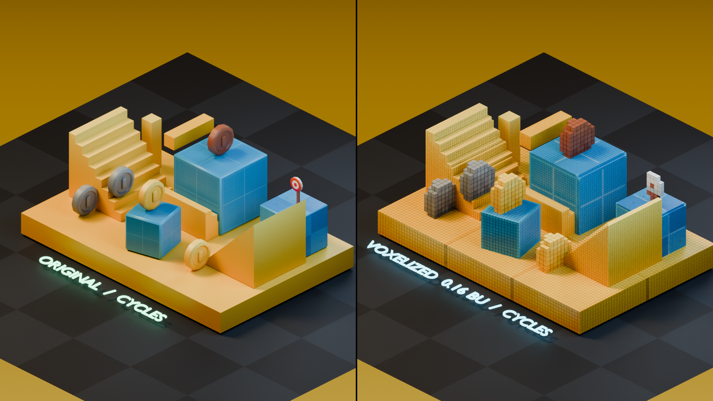
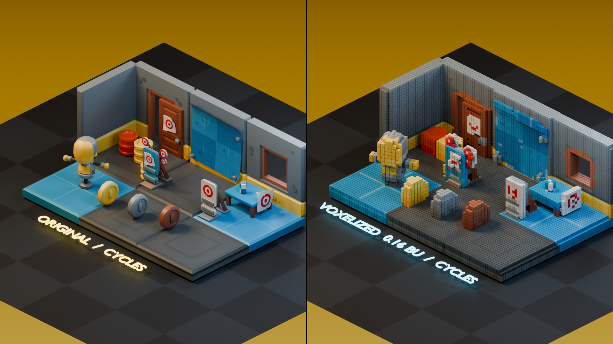

# Chromoxel

**Texture-aware voxelization for Unreal Engine and Blender.**  
面向 Unreal Engine 与 Blender、能够保留贴图细节的体素化工具集。

Chromoxel explores a practical workflow for turning textured meshes and scenes
into editable, renderable voxel geometry. The project currently provides two
platform-specific implementations under separate branches.

| Platform | Target | Current focus | Branch |
| --- | --- | --- | --- |
| Blender | Blender 5.1 | Live preview, texture sampling, symmetry-safe grids, and Bake to Mesh | [View Blender implementation](https://github.com/SKu11zZ/Chromoxel/tree/blender) |
| Unreal Engine | Unreal Engine 5.8 | Editor-side voxelization, BaseColor capture, and HISM scene preview | [View Unreal implementation](https://github.com/SKu11zZ/Chromoxel/tree/unreal) |

## Multi-model and multi-level voxelization

The Blender implementation is tested on Suzanne, a UV sphere, a torus, and a
concave NGON prism. The comparison covers coarse, medium, and fine voxel sizes,
including curved surfaces, holes, corners, thin features, and symmetric forms.

## Full-scene comparisons

The following images compare the original Cycles render on the left with a
Chromoxel surface-voxel Bake rendered in Cycles on the right.

Both voxelized scenes use a `0.16 BU` cell size. Scene composition, lighting,
voxelization, and final Cycles rendering were produced for the Chromoxel
project.

**Asset source:** [KayKit: Prototype Bits 1.1 (FREE)](https://kaylousberg.itch.io/prototype-bits),
created and distributed by [Kay Lousberg](https://www.kaylousberg.com/). The
asset pack is licensed under [CC0 1.0 Universal](https://creativecommons.org/publicdomain/zero/1.0/).
Only rendered comparison images are included here; the original asset files
are not redistributed in this repository.

## Shared goals

- Preserve recognizable silhouettes, corners, holes, and thin features.
- Retain source colour and texture information wherever the platform permits.
- Keep symmetric source meshes symmetric after voxelization.
- Provide a fast preview path and a concrete baked-output path.
- Scale from single props to small environment scenes.
- Keep generated data identifiable and safely removable.

## Project status

Chromoxel is currently a beta-stage technical project. The Blender and Unreal
implementations do not share a runtime or file format yet; they share the same
visual goal and are developed as platform-native tools.

Installation, usage, compatibility notes, packages, and validation records are
maintained in the corresponding platform branch.

## License

Chromoxel source code and project documentation are released under the
[Apache License 2.0](LICENSE). Third-party demonstration assets retain their
respective licenses as credited above.

